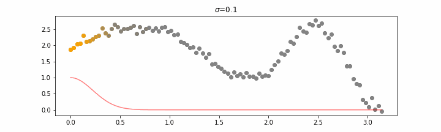
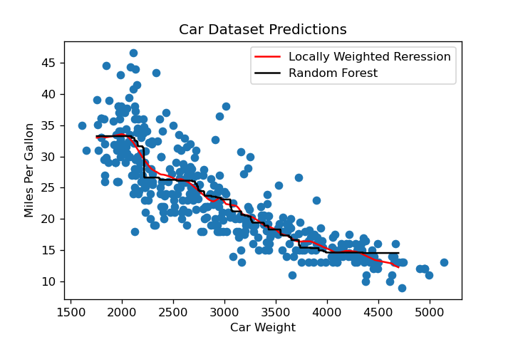
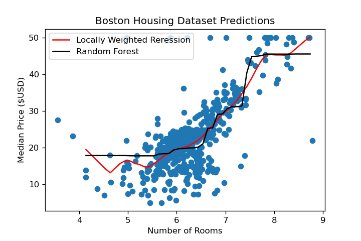

# Project 2

This page explores the similarities and differences of Locally Weighted Linear Regression and Random Forests for Project 2 in Data 410: Advanced Applied Machine Learning. All analysis was performed by Bryce Whitney. 

## Theoretical  Discussion

### Locally Weighted Regression

A Locally Weighted Regression is an extension of a Linear Regression, so we must first understand the big ideas behind Linear Regressions. At the base level, a Linear Regression is trying to solve the following equation:

<p align="center">

</p>


Where *x* are the features, *y* is the dependent variable, and *beta* is a matrix of the weights. The goal is to find the weights that optimize this equation and minimize the amount of error. In the studies presented below, I used mean squared error to measure the effectiveness of the weight parameters.

In a Locally Weighted Regression, instead of calculating one line of best fit for the entire dataset it builds the model by fitting smaller lines locally and then connecting them all together to create the final model. The difference between a typical OLS method in Linear Regression and a Locally Weighted Regression is that only local points contribute to the estimation of weights. Scikit-learn provides a good animation of how Locally Weighted Regression works. For given *x* values, the points in yellow are the only points being considered when determinging these weights. As you can see only the local points contribute to the weights, but in the end they can be combined to construct the weights for the entire model.


<p align="center">
  
</p>

By building the weights and line of best fit locally, the line of best fit has more freedom to adjust to local changes in the data. This can lead to more accurate predictions as the model can adjust to changes throughout the data more effectively, but can also lead to problems when the data is extremely noisy because the Locally Weighted Regression may start modelling the local noise instead of the actual relationship. 

### Random Forest
A Random Forest is just a collection of *n* Decision trees, so to understand how a Random Forest works you must understand how Decision Trees work. I find the best way to think of Decision Trees is as a flowchart. Data is separated into containers using a series of conditionals, and each container (leaf node) has a prediction value associated with it. When making predictions, data is passed through the series of conditionals to determine what the predicted value will be. An extremely simple example from [Medium](https://chirag-sehra.medium.com/decision-trees-explained-easily-28f23241248) is shown below. If someone is over 30 years old and exercises in the morning they would be considered fit, while someone under the age of 30 who eats pizza would be considered unfit. 

<p align="center">
  
</p>

As stated above, a Random Forest is just a collection of Decision Trees. That means a Random Forest with *n_estimators = 100* will be made up of 100 Decision Trees. For predictions, data is passed throuh all 100 Decision Trees and the predictions from these Decision Trees are stored. If it is a classification problem, whichever class was most common will be output from the Random Forest, and if it is a regression problem, the results will be averaged together. Random Forest has the benefit of not using distances to calculate any parameters in the model, so it is likely less affected by noise compared to the Locally Weighted Regression. 

## Cars Dataset

## Data Preprocessing
Data was split into training and testing sets where the training data consisted of 75% of the observations, and the other 25% were in the test set. The data was then normalized using the training data. Scaling the data is only necessary for the Locally Weighted Regression because Random Forest performs the same on normalized and unnormalized data as it doesn't calculate the distance between observations. The code for this is shown below. 

```python
# Train-Test Split
Xtrain, Xtest, ytrain, ytest = train_test_split(x, y, test_size=0.25, random_state=13)

# Scale the data
scale = StandardScaler()
Xtrain_ss = scale.fit_transform(Xtrain.reshape(-1, 1))
Xtest_ss = scale.transform(Xtest.reshape(-1, 1))
```
For the Locally Weighted Regression the two hyperparameters I scanned for were the choice of kernel and tau value. There were three different kernel functions considered (Tricubic, Epanechnikov, Quartic) and tau values scanned were every tenth between 0.1 and 1. For each combination, the mean squared error on the scaled test set was calculated, and the parameters that produced the lowest mean squared error were saved to be used later. I found **tau = 0.1** with an **Epanechnikov kernel** were the best parameters. The code is shown below. 

```python
taus = np.arange(0.1, 1.1, 0.1)
kernels = [tricubic, Epanechnikov, Quartic]
best_mse_lr = 10**10
best_params_lr = tuple()

for tau in taus:
    for kern in kernels:
        y_pred = lowess_reg(Xtrain_ss.reshape(Xtrain_ss.shape[0]), ytrain, Xtest_ss.reshape(Xtest_ss.shape[0]), kern, tau)
        mse = MSE(ytest, y_pred)
        
        if(mse < best_mse_lr):
            best_mse_lr = mse
            best_params_lr = (tau, kern)

print("Best MSE: ", best_mse_lr)
print("Best Parameters:", best_params_lr)
```
The same parameter selection process was used for the Random Forest. The two hyperparameters I scanned for were the number of estimators and max depth of the trees. The number of estimators to scan were chosen discretely between 50 and 1000, and the max depth scanned every integer from 2 to 10. I found a model with **50 trees** with a **max depth of 2** produced the lowest mean squared error.

```python
n_estimators = [50, 100, 200, 500, 1000]
max_depth = np.arange(2, 11, 1)

best_mse_rf = 10**10
best_params_rf = tuple()

for n in n_estimators:
    for d in max_depth:
        model = RandomForestRegressor(n_estimators=n, max_depth=d, random_state=13)
        model.fit(Xtrain.reshape(-1, 1), ytrain)
        mse = MSE(ytest, model.predict(Xtest.reshape(-1,1)))

        if(mse < best_mse_rf):
            best_mse_rf = mse
            best_params_rf = (n, d)

print("Best MSE: ", best_mse_rf)
print("Best Parameters:", best_params_rf)
```

This process of splitting the data into training and testing sets and scanning for optimal hyperparameters was executed for both the cars dataset and the Boston housing dataset. The optimal parameters were then used when calculating the crossvalidated mean squared error for each model. For both models I performed a 5-fold crossvalidation to obtain the crossvalidated mean squared error. I chose to use 5 folds because there were 392 observations in the car data, leaving roughly 78 observations for each fold. Anything less than this would have been too small a validation sample in my opinion. Random states were utilized to ensure results are reproducible. The code for obtaining each crossvalidated mean squared error are shown in their respective sections below. 

### Locally Weighted Regression
When calculating the crossvalidated mse, the data was always normalized before being passed to the 'lowess_reg' function. The model with **tau = 0.1** and the **Epanechnikov kernel** identified earlier was used with every fold. The Locally Weighted Regression produced a **crossvalidated MSE =  18.004**. The code used to obtain this is shown below. 

```python
kf = KFold(n_splits=5, random_state=13, shuffle=True)

scores = []

for train_idx, test_idx in kf.split(x):
    Xtrain, Xtest = x[train_idx], x[test_idx]
    ytrain, ytest = y[train_idx], y[test_idx]
    
    scale = StandardScaler()
    Xtrain_ss = scale.fit_transform(Xtrain.reshape(-1, 1))
    Xtest_ss = scale.transform(Xtest.reshape(-1, 1))
    
    y_pred = lowess_reg(Xtrain_ss.reshape(Xtrain_ss.shape[0]), ytrain, Xtest_ss.reshape(Xtest_ss.shape[0]), 
                                          best_params[1]_lr, best_params[0]_lr)
    mse = MSE(ytest, y_pred)
    
    scores.append(mse)
    
print("Locally Weighted Regression Crossvalidated MSE: ", np.average(scores))
```

### Random Forest
Unnormalized data was used for Random Forest calculations. This is because scaling the data doesn't make a difference, so it is more efficient to use the unnormalized data. The model with **n_estimators = 50** and  **max_depth = 2** identified earlier was used with every fold. The Random Forest Regression produced a **crossvalidated MSE =  18.228**. The code used to obtain this is shown below. 

```python
kf = KFold(n_splits=5, random_state=13, shuffle=True)

scores = []

for train_idx, test_idx in kf.split(x):
    Xtrain, Xtest = x[train_idx], x[test_idx]
    ytrain, ytest = y[train_idx], y[test_idx]
    
    model = RandomForestRegressor(n_estimators=best_params_rf[0], max_depth=best_params_rf[1], random_state=13)
    model.fit(Xtrain.reshape(-1, 1), ytrain)
    mse = MSE(ytest, model.predict(Xtest.reshape(-1, 1)))
    
    scores.append(mse)
    
print("Random Forest Crossvalidated MSE: ", np.average(scores))
```
### Conclusion
As a recap, the Locally Weighted Regression has a crossvalidated MSE = **18.004** while the Random Forest had a crossvalidated MSE = **18.228**. This indicates the **Locally Weighted Regression may be slightly more reliable when using the cars dataset**. This intuition holds when looking at the predictions made by the Locally Weighted regression and Random Forest in the figure below. The Locally Weighted Regression appears less sporadic than Random Forest highlighting that it may be slightly less overfit and better explain the relationship between a cars weight the miles per gallon it achieves. 



## Boston Housing Dataset

The same exact data preprocessing methods that were used for the cars dataset were used for this Boston Housing dataset. If you need a detailed description, please see the `Data Preprocessing` section. For the Locally Weighted Regression, the best model had **tau = 0.3** and a **Epanechnikov kernel**, while the best Random Forest model consisted of **500 trees** with a **max depth of 2**. To obtain the crossvalidated mean squared error, I again used a 5-fold crossvalidation. Random states were used to ensure the results are reproducible. 

### Locally Weighted Regression
When calculating the crossvalidated mse, the data was always normalized before being passed to the 'lowess_reg' function. The model with **tau = 0.3** and the **Epanechnikov kernel** identified above was used with every fold. The Locally Weighted Regression produced a **crossvalidated MSE =  36.932** on the Boston Housing data. The code used to obtain this is shown below. 

```python
kf = KFold(n_splits=5, random_state=13, shuffle=True)

scores = []

for train_idx, test_idx in kf.split(x):
    Xtrain, Xtest = x[train_idx], x[test_idx]
    ytrain, ytest = y[train_idx], y[test_idx]
    
    scale = StandardScaler()
    Xtrain_ss = scale.fit_transform(Xtrain.reshape(-1, 1))
    Xtest_ss = scale.transform(Xtest.reshape(-1, 1))
    
    y_pred = lowess_reg(Xtrain_ss.reshape(Xtrain_ss.shape[0]), ytrain, Xtest_ss.reshape(Xtest_ss.shape[0]), 
                                            best_params_lr[1], best_params_lr[0])
    mse = MSE(ytest, y_pred)
    
    scores.append(mse)
    
print("Locally Weighted Regression Crossvalidated MSE: ", np.average(scores))
```

### Random Forest
Unnormalized data was again used for Random Forest calculations. The model with **n_estimators = 500** and  **max_depth = 2** identified earlier was used with every fold. The Random Forest Regression produced a **crossvalidated MSE =  36.328** on the Boston Housing data. The code used to obtain this is shown below.

```python
kf = KFold(n_splits=5, random_state=13, shuffle=True)

scores = []

for train_idx, test_idx in kf.split(x):
    Xtrain, Xtest = x[train_idx], x[test_idx]
    ytrain, ytest = y[train_idx], y[test_idx]
    
    model = RandomForestRegressor(n_estimators=best_params_rf[0], max_depth=best_params_rf[1], random_state=13)
    model.fit(Xtrain.reshape(-1, 1), ytrain)
    mse = MSE(ytest, model.predict(Xtest.reshape(-1, 1)))
    
    scores.append(mse)
    
print("Random Forest Crossvalidated MSE: ", np.average(scores))
```
### Conclusion 
As a recap, the Locally Weighted Regression has a crossvalidated MSE = **36.932** while the Random Forest had a crossvalidated MSE = **36.328**. This indicates the **Random Forest may be slightly more reliable when using the Boston Housing dataset**. Unlike the cars dataset, the Locally Weighted Regression appears to be more sporadic, particularly towards the extremes of the data, when compared to the Random Forest. However, I am not willing to claim that the graph below shows Random Forest is clearly better than Locally Weighted Regression, because it may only appear that way since we know the crossvalidated mean squared error values for each model. 



# Final Discussion
At this point we have seen an example where Locally Weighted Regression performed slightly better than Random Forest and an example where Random Forest showed slightly better predictive power. This suggests that the properties of the data being used will impact which model is the best to use. Like most cases in Data Science, I don't believe there is one model that will always achieve better results over the other. *I believe Locally Weighted Regression will be better for less noisy datasets, while Random Forest will perform better on datasets with a lot of noise*. This was highlighted by the performance on the Cars and Boston Housing datasets, but I don't think one example is good enough to support the claim. One of the major differences between Locally Weighted Regression and Random Forest is that Locally Weighted Regression uses a distance metric when determining the weights while Random Forest doesn't. In noisy datasets, the noisy points will have a large impact on the weights because their distance from other points is so large. On the other hand, Random Forest is able to counteract that because instead of distance, Decision Trees use cutoff points to create boxes that data either fit into or don't. **For this reasons I believe Random Forest will tend to perform better on noisy datasets, but can't compete with the precision of Locally Weighted Regression on data sets with minimal noise**.
